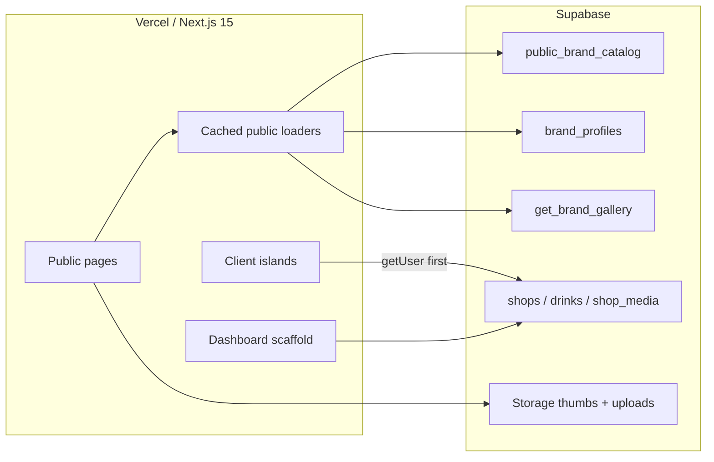

# Bobadex web

Public catalogue for [Bobadex](https://bobadex-web.vercel.app): browse boba brands, read enrichment dossiers, and peek at community photos. Logging shops and drinks still belongs to a personal dex, which is **off** on this preview.

This repo is the Next.js site. Postgres, storage, OSM ingest, and enrichment workers live in `bobadex-backend`. Review/publish of dossiers is `bobadex-admin`. The original drink tracker is the Flutter app.

## Current version

Shipped as a **catalogue preview** on Vercel (`main` → production). Accounts do not work unless `NEXT_PUBLIC_AUTH_ENABLED=true`.

What is live:

- Home: brand constellation, featured stage, achievement teaser, rankings empty state
- `/brands` search and A–Z explorer
- `/brands/[slug]` dossier: unofficial icon, community rating (or **Unrated**), `public_summary`, market/tag chips, extra facts, public photo strip
- `/achievements`, `/rankings`, `/about`
- Sign-in CTAs land on “accounts aren’t open yet”

What is intentionally thin:

- Rankings stay empty until enough real shop ratings exist. No demo filler.
- Personal drinks on a brand page are a lock/preview that points at the dashboard, not a form.
- The dashboard exists as a scaffold (shop grid + drink list) and is unreachable while auth is gated.

## What’s left

- Turn auth back on (`NEXT_PUBLIC_AUTH_ENABLED=true`) and finish login/signup so people can keep a dex
- Dashboard CRUD: add/edit shops and drinks, photos, favorites — the Flutter app already does this
- Rankings once real `shops.rating` rows exist (the catalog view already aggregates them)
- Flutter features skipped on web v1: activity feed, report-closed, other people’s drink lists
- Promote enrichment schema/data into production Postgres. The site currently reads the API from the DEV preview project and brand thumbs from production storage
- Fill public galleries as drinkers upload `visibility = 'public'` media

## Architecture



Three Supabase clients, on purpose:

| Client | File | Use |
|--------|------|-----|
| Cookie-less public | `utils/supabase/public.ts` | SSR catalogue reads. No session, so `unstable_cache` is safe. |
| Cookie server | `utils/supabase/server.ts` | Auth-aware server work (dashboard, `/api/brands`). |
| Browser | `utils/supabase/client.ts` | Session islands: sidebar viewer, “your drinks” on a brand page. |

Public routes (`/`, `/brands`, `/achievements`, `/rankings`, `/about`, `/auth`) skip login. Anything else redirects home while auth is gated.

Layout is `PublicShell` (cream `#fbf8f0` / ink `#2b241f`, sidebar). Feature UI lives under `src/features/*`; the App Router pages stay thin.

Caching: brand index and dossier facts ~1h (`unstable_cache` + `revalidate` on the page). Gallery ~5 minutes so new public photos show up sooner. Brand thumbs are treated as immutable hashes (`minimumCacheTTL` 30 days).

## Backend design

Bobadex is one Supabase project (Postgres + Edge Functions). The web app is a reader of the **public** surface; it does not run OSM or LLM jobs.

**Catalogue, not the raw `brands` table.** Pages load `public_brand_catalog` (`security_invoker`). That view is active brands only, drops `brands.is_demo`, and exposes card fields plus `public_summary`. Prefer it over `get_brand_stats`, which does not filter demo brands. If ratings are empty, the UI says **Unrated**.

**Consumer copy vs research copy.** `brand_profiles.public_summary` is the short published blurb (length-checked, synthesized from approved facts). Internal `summary` / research notes stay off the site.

**Facts as JSON, parsed here.** Published enrichment is `brand_profiles.profile_facts`. The web maps a consumer subset: founded place/year, `market_presence` (country then metro, cap 4), tags (`signature_products` → `known_for` → `product_categories`), aliases, a couple of extra scalars, and `observed_at`. Hero chips reuse `src/features/home/chips.ts`. Accent colors are hashed from the slug against a small palette, not 491 custom themes.

**Photos are public-only.** `get_brand_gallery(slug, limit, offset)` joins `shop_media` where `visibility = 'public'`. Empty gallery copy is honest. No owner edit on the brand page.

**Personal data stays behind auth.** `shops` / `drinks` are the user’s dex. The brand-page island calls `getUser()` first; guests never query those tables.

**Storage split.** `NEXT_PUBLIC_SUPABASE_URL` is the API project. `NEXT_PUBLIC_SUPABASE_ASSET_URL` can point at production storage so thumbs (`thumbs/s256|s512/...` in `shop-media`) keep working while the API is a preview branch. User photos use the `media-uploads` bucket.

**Locations and art.** Shop geography is OSM-backed in the backend. Icons/mascots are unofficial (some AI-assisted). If a brand objects, the UI falls back to initials.

Related repos: `bobadex-backend` (migrations + functions; DEV `xnkpatktudnycpkbmvsf`, prod `vsiuyynrooqzcstzyeir`), `bobadex-admin` (enrichment review).

## Local development

```bash
pnpm install
pnpm dev
```

Needs `.env.local`:

```
NEXT_PUBLIC_SUPABASE_URL=
NEXT_PUBLIC_SUPABASE_ANON_KEY=
NEXT_PUBLIC_SUPABASE_ASSET_URL=
# NEXT_PUBLIC_AUTH_ENABLED=true   # omit to keep the preview gate
```

`pnpm build` / `pnpm lint` (`biome`) before shipping. Production is GitHub `main` → Vercel project `bobadex-web`.
